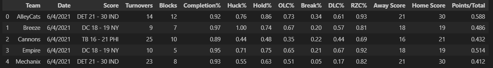
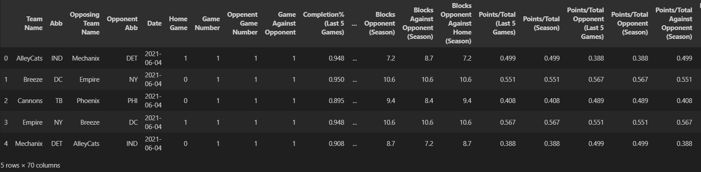

# AUDL AI Game Predictor


This README will give an overview of the steps required to create this project. More detailed comments are available in the markdown cells and comments in the Jupyter Notebooks. This project has three main code files. The first is **Data_Constructor.ipynb** which uses data from the AUDL website to construct a dataframe with sufficient columns and statistics to train a model on. **Input_Generator.ipynb** defines functions that create input data based on an upcoming game. **AUDL.ipynb** is where the neural network is built, trained, and produces an output. 

In addition to these are several csv files. **AUDL_pd.csv** final processed data that the model can be trained on. **Raw_Data.csv** is data taken directly from the AUDL Stats website. **Raw_Data_Improve.csv** is a slightly more cleaned up version of Raw_Data.csv in that some of the column names are changed, unnecessary columns are dropped, and the formatting is overall better. **Team_Averages.csv** contains averages for different statistics over 2022-23 seasons for all teams in the AUDL. 


### Overview

1. Introduction
2. Loading the Data
3. Constructing a new Dataframe
4. Creating an Input Generator
5. Building the Model
6. Results
7. Future Plans


### Introduction
In recent years, machine learning has been used more and more for sports analytics. It is even becoming common in major sports such as football, soccer, and baseball. As an Ultimate Frisbee player, wondered if it would be possible to create a model to predict the outcomes of professional games in the AUDL (American Ultimate Disc League). It was! By simply entering the two team names, the date of the game, and its home or away status, the model will predict an outcome. For example:

**Team One:** Shred

**Team Two:** Empire

**Date:** 7/4/2023

**Home:** 0

**Output**: AUDL AI predicts the Shred have a 33.2% chance of beating the Empire!

This sport is relatively new, which is another reason I was excited to create this model since it offers interesting statistical insights nobody has uncovered yet. If you are unfamiliar with the sport, watch this [QUICK VIDEO](https://www.youtube.com/watch?v=3oM-sNFpvjc) to learn more. If you are even more interested check out this [HIGHLIGHT VIDEO](https://www.youtube.com/watch?v=PyVuV18Xm8c) by UNC Darkside (my team!).

All original data used in this project comes from the [AUDL Stats](https://theaudl.com/league/stats) page. This has comprehensive data on every game played over the past 10 or so years. Since the raw data could not be fed into a model, the vast majority of time on this project was spent augmenting this data, cleaning it up, and calculating new statistics. From the original 12 columns of data on the AUDL website, I calculated 70 unique columns of data to better describe each game. Details on these columns, and all the data rearrangement can be found in the Data_Constructor.ipynb file.


### Loading the Data

First, read the raw csv data into a pandas dataframe. Some of the column names were not very descriptive or did not contain relevant information so these columns were dropped. 

I also read in the averages csv file which contained average values for each team. For example, it will store the average **Completion %** for the New York Empire over the past two years. It stores plenty of other metrics, and for all the teams in the AUDL.


### Constructing a New Dataframe

As stated before, the biggest hurdle in this project was getting the data into a format that a neural network could use to train. To understand why this was so difficult take a look at a few rows of the **Raw Data**:



There are three major problems with this:
1. **Post-Game Stats are not Useful**
The purpose of this project is *predict* games. The raw data only has metrics about the game after it is over. If I am going to predict a game outcome, I need to feed into the model metrics that describe a game *before*  it happens. If I am training a model on post-game stats it is extremely easy to tell who will win. For example, if I give the model the score of the game it will obviously tell who won. 

Solution: Use information from past games. I can create new columns of data that contain average stats from the past. For instance, instead of feeding in the score column seen in the raw data, I figure out the average score for all previous games that season. This is a metric I can calculate before the game and can be used to make predictions. 

3. **Not enough input data!**
Sports is very complicated and cannot be described by the few stats seen above. If my model is to be accurate, I need to find a way to give the model more information.

Solution: These columns contain more information than immediately appears. From just Completion Percentage I can calculate metrics such as *AVG Completion% over past 5 games*, *AVG Completion% over season*, *AVG Completion% against opponent*. I can do the same thing for the opponent! In this project I calculated 7 different metrics from Completion Percentage. This is what allowed me to get from 12 raw data columns to 70 calculated columns of data. 

5. **Raw Data non descriptive**
What I mean by this is that the format of the raw data is terrible. For instance, the score column has chars and ints which switch order depending on whether the game is home or away. The abbreviations are also inconsistent since some teams underwent name changes in 2021.

Solution: Create a whole new data frame that can be built up from scratch. By doing this I can separate out important information and have more control over what data I want to include. 


I named this new dataframe `calculated_df`. Below are a few rows of this dataframe after all calculations have been performed. 




Creating this dataframe took 95% of my time on this and required me to solve many challenges. I am not going to dive deep into all the steps it took to create this on the README, but if you open **Data_Constructor.ipynb** I have a very detailed explanation of my process and what each column means. I will however give an overview of the structure. 

Rows: **Individual Games**


Each row represents a game that took place in the past three years. Each game will have a "duplicate" entry though. One for each team that played in the game. For instance, if New York played Salt Lake, there would be an entry from the perspective of New York, and another one from the perspective of Salt Lake. This is not repetitive though, since the two rows will contain different information. One pertaining to New Yorks stats from the game, and the other about Salt Lakes stats from the game. 

First 5 Columns: **Identifying Information**


These columns contain basic information such as the team names, abbreviations, and the date. These will eventually be stripped when training the model since they are not numerical, and I do not want the model to make predictions based on team names. For instance, the New York Empire win almost all their games. The model could easily just start predicting all wins because the team name matches "Empire" and the season is "2023". 

Columns 6-9: **Place and Game in Season**


Columns 6 describes if it is a home game or not (from perspective of the team name in column one). Columns 7-9 describe how many games the teams have played so far in the season, and how many they have played against each other. This is super important when taking averages. For example, If I am taking the average Completion Percentage over the past 5 games, but they have only played 1 game so far, it might be best to use last seasons average or some other baseline (**Team Averages.csv**). 


It also might give the model insight into how seriously to take some of the calculated fields. If there are a low number of games played against a particular opponent, the model can use this data and predict the outcome with less certainty. But, if there have been many games against an opponent it can be confident in using previous game statistics to make a prediction. 


Columns 10-70: **Calculated Statistics**

There are 10 different stats I used for these columns:


[`Completion %`,	`Huck %`,	`Hold %`,	`OLC %`,	`Break %`,	`DLC %`,	`RZC %`]


For each of these stats I computed 7 more specialized statistics. The code for Completion Percentage is shown below. Note, I used the `stat_pct` function which is defined in **Data_Constructor.ipynb** to take these averages. 

```
avg_index = 2
stat = "Completion%"
avgerage_column = 'Completion%'

calculated_df[f'{stat} (Last 5 Games)'] = stat_pct('Team Name', 5, avgerage_column , avg_index)
calculated_df[f'{stat} (Season)'] = stat_pct('Team Name', -1, avgerage_column ,avg_index)
calculated_df[f'{stat} Opponent (Last 5 Games)'] = stat_pct('Opposing Team Name', 5, avgerage_column ,avg_index)
calculated_df[f'{stat} Opponent (Season)'] = stat_pct('Opposing Team Name',-1,avgerage_column , avg_index)
calculated_df[f'{stat} Against Opponent (Season)'] = stat_pct('Team Name', -1,avgerage_column , avg_index,'Opposing Team Name')
calculated_df[f'{stat} Opponent Against Home (Season)'] = stat_pct('Opposing Team Name',-1,avgerage_column , avg_index,'Team Name')
```

I then stored the resulting dataframe as **ADUL_pd.csv**. This means that **Data_Constructor.ipynb** is only used when you want to add more games to the training dataset. As the current 2023 season continues, I will continue adding games and updating the csv. 

### Creating the Input Generator
In **Input_Generator.ipynb** I defined the function `stat_pct_input` which takes in identifying data (Team1 name, Team2 name, Date, Home or Away), and generates all 70 rows of data in the exact same format as **AUDL_pd.csv**. The only difference is that this is a hypothetical future game, and thus does not have an outcome assigned to it. 

This was a very simple task since the main function used `stat_pct_input` was almost exactly the same as the `stat_pct` function defined in **Data_Constructor**. Below is an example of using this function. 

```
team1 = "Shred"
team2 = "Empire"
date = "7/4/2023"
home = 1
audl_input = get_input_data(team1,team2,date,home)
```

### Building the Model

Using the **AUDL_pd.csv** data I first split it into testing and training data. I used 10% of the data for testing. I also chose which column the model will be trying to predict. I chose the `Result` column which has a binary result (1 win, 0 loss) for each game.

I chose to use a simple sequential model with Dense nodes and only two hidden layers. The model has an input layer which feeds into hidden Dense layers of 35 and 10. The activation function I am using here is `relu` to avoid and disappearing gradients. Also, I am using L2 Regularization to prevent overfitting. This drags the weights of the network towards zero which distributes weights more evenly reducing complexity. Since there is a limited pool of training data, this is very important. The output layer is a single node which has a sigmoid activation. The model is compiled with an `sgd` optimizer function and a loss of `mean_squared_error` since this is a binary classification problem (win or loss). 

```
model = tf.keras.models.Sequential([
    Dense(64, activation='relu'),
    Dense(35,kernel_regularizer=l2(0.01), activation='relu'),
    #Dropout(.1),
    Dense(10,kernel_regularizer=l2(0.01), activation='relu'),
    Dense(1, kernel_regularizer=l2(0.01), activation='sigmoid')
    ])

model.compile(optimizer='sgd',
    loss='mean_squared_error',
    metrics=['accuracy'])
```


### Results

I trained the model with a batch size of 8 over 10 epochs. I used a smaller batch size since I have limited data and want the model to update frequently. 

Analyzing the results of the training, the training accuracy increases to around 74% after only a few epochs where it stabilized. The test accuracy also increases to around this range. Since the training accuracy does not shoot up to near 100%, it shows that overfitting was prevented by teh L2 regularization. Also, the test accuracy is greater than 50% (baseline accuracy) which shows that the model is learning correctly. 

I tried changing the structure of the model and retraining it. However, the test accuracy was very consistently around 75%. To get the accuracy higher, I need more data.

To test out my model, I tried predicting an upcoming game between the only two undefeated teams left in the AUDL, the Salt Lake Shred and the New York Empire. My model predicted that the Shred had a 33.2% chance of beating Empire. Immediately after seeing this output I was reassured I was on the right track. This seemed like a very realistic prediction. Sure enough, the Shred lost out to Empire by a few points. I have since used it on many other games, and it is generally accurate!


### Future Plans

Some future steps may be to add more data so that the model can become more realistic. I am only working with 3 years of AUDL data at this point since before that statistics were recorded very differently and would require different code to standardize with the current data. I also hope to eventually inlcude individual player statistics into this model since I think that will give it a higher accuracy. All of the statistics used so far are team averages rather than individual player data. 


